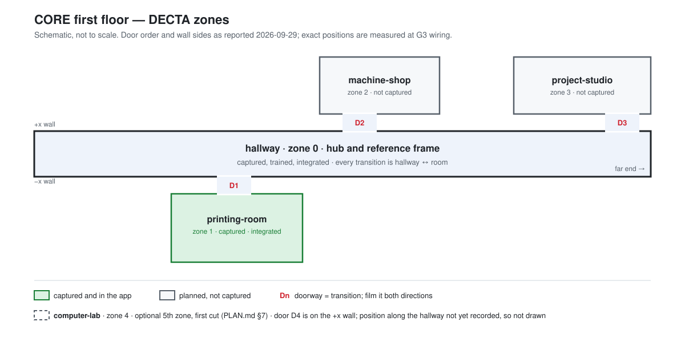

# Zones — CORE first floor

Closes #28. This file and `docs/img/first-floor-zones.svg` are the definition of "every expected
zone" at G3 (Oct 9). A zone that is not listed here was never planned; a zone listed here that is
not primitive on Oct 9 is cut at the G3 review and marked **Cut** below — not deleted.

Topology is a star: the hallway is the hub and the shared reference frame, and every transition is
hallway ↔ room. Boundaries sit at doorway chokepoints so each training run stays inside the 8 GB
VRAM ceiling.

## Marked-up plan

Schematic, not to scale: it records which rooms are zones, which wall each door is on, and door
order. It is an SVG so anyone can edit it in a text editor. A photo of the posted evacuation map
can replace it later without changing anything else in this file.

## Zone list

| # | id | Label | Status | Splat file |
|---|----|-------|--------|------------|
| 0 | `hallway` | CORE Hallway | Captured, trained, integrated (hub, reference frame) | `hallway.compressed.ply` |
| 1 | `printing-room` | 3D Printing Room | Captured, trained, aligned, integrated, NPCs in | `printing-room-updated.compressed.ply` |
| 2 | `machine-shop` | Machine Shop | Outstanding — not captured | — |
| 3 | `project-studio` | Project Studio | Outstanding — not captured | — |
| 4 | `computer-lab` *(optional 5th zone — first cut per PLAN.md §7)* | Computer Lab | Outstanding — not captured | — |

Ids are short, lowercase, hyphenated, and must match the `id` in `public/zones.json` and the splat
filename prefix. The splat must end in `.compressed.ply` or Git silently ignores it.

## Doorways off the hallway

Every doorway listed here is a transition that must be filmed through **from both directions**
(capture protocol step 6) and wired in `zones.json` at G3. A doorway not listed here does not get
a transition — its opening stays behind a hallway collision wall.

Positions are in app coordinates: hallway spawn is the origin, z runs along the hallway
(~−20.2 m to ~19.0 m, the measured 128 ft), the two long walls sit at x ≈ −1.1 and x ≈ +1.1.

| # | Leads to | Wall | z range (m) | Filmed both ways | Wired in `zones.json` |
|---|----------|------|-------------|------------------|-----------------------|
| D1 | `printing-room` | −x | 4.80 – 6.55 | Yes (aligned 2026-09-24) | Yes |
| D2 | `machine-shop` | +x | Measured at G3 — slightly past D1 | No | No |
| D3 | `project-studio` | +x | Measured at G3 — at the far end of the hallway | No | No |
| D4 | `computer-lab` | +x | Measured at G3 — order along the hallway not yet recorded | No | No |

All three new doors are on the +x wall, opposite the printing room, and all three are inside the
captured hallway (Johnny, 2026-09-29).

**Why z ranges wait until G3:** they are only consumed when a transition is wired, and they are
read off the already-shipped hallway splat, the same way D1 was aligned on 2026-09-24. Measuring
them now would not save that step. What *did* need settling at G2 is that every door is inside the
captured hallway (z ≈ −20.2 to 19.0 m, the full measured 128 ft), because a door beyond either end
would need a second hallway capture before the Oct 16 capture stop.

**G3 wiring note:** the hallway's +x collision wall is currently one unbroken box from z −20.2 to
16.33, plus the widened end-section box from 16.33 to 19.0. Each of D2–D4 needs a gap cut into
whichever box it falls in, the same way the −x wall is split at 4.80 – 6.55 for D1.
